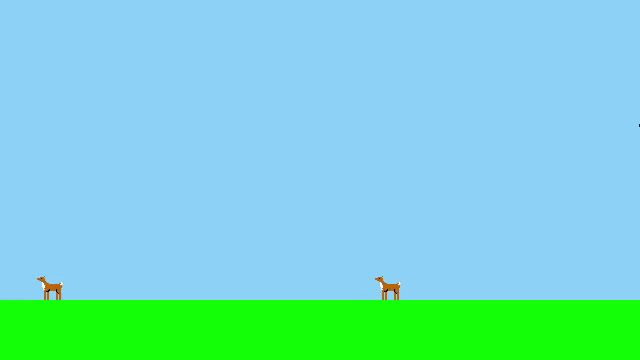

# Hello! My name is Collin Sparks.

I'm a dance and theatre nerd who also happens to love working with computers.

Solving a problem is super motivating for me -- and I love when I'm able to see real results from my work!

## Current Work

I'm highly exited to be working on a collaborative project right now called **"Solo"**!

Myself and 2 other developers are building a SaaS-scale application, and I'm having a great time on it. So far, my friend (more senior than I) is focusing on the detailed project-management side, I am implementing the foundation to the codebase, and the third developer is more junior / learning.

I feel very good about the organization and state of the project. It's refreshing to work alongside other developers!

## Other Work

Early in 2021, I "finished" my [*web-contact-converter*](https://github.com/spark-c/web-contact-converter) project, and I'm super happy to have deployed it as my largest / most-useful complete full-stack web app.

Later, I shifted to other projects e.g. extending my [discord bot](https://github.com/spark-c/baby-bot), and practicing React.js (with my [personal site](https://spark-c.github.io) and my [coffee calculator](https://coffee-calculator-nine.vercel.app))! Repos [here](https://github.com/spark-c/spark-c.github.io) and [here](https://github.com/spark-c/coffee-calculator) respectively.

And lots of other smaller experiments as well :)

Please reach out to me if you have any comments about my code, or if you'd like to collaborate on any project! I'd love to hear from absolutlely anyone.
I can best be reached by email at cklsparks@gmail.com, Twitter [@collin_sparkles](https://twitter.com/collin_sparkles), or on Discord "spark.c#7001"

Cheers!

<!---
spark-c/spark-c is a ✨ special ✨ repository because its `README.md` (this file) appears on your GitHub profile.
You can click the Preview link to take a look at your changes.
--->
